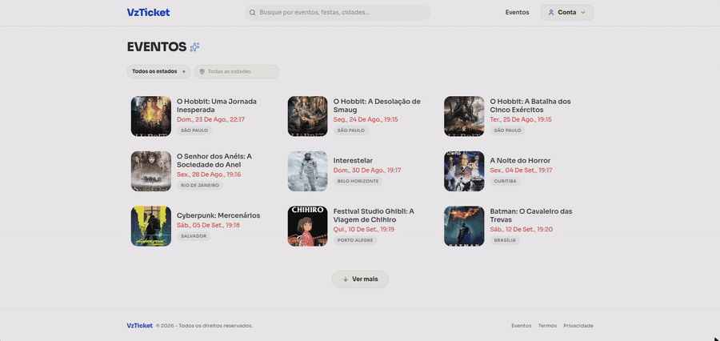
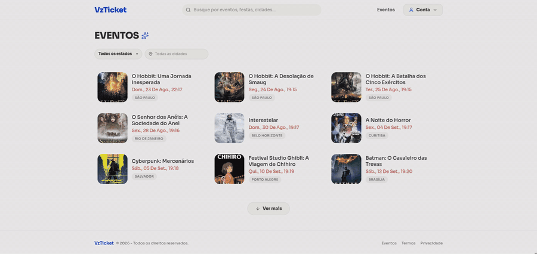
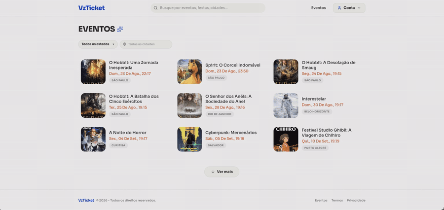
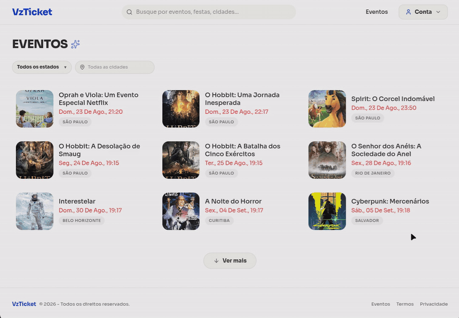

# vzticket 🎫 — Desafio Técnico Verzel

> **Status do Projeto:** Concluído  
> Projeto desenvolvido como solução para o **Desafio Elite Dev / Desafio Técnico Verzel**.

<p align="center">
  
  
  
  
  
  
  
</p>

Plataforma completa de gestão, venda e validação de ingressos para eventos (modalidade Pista), com sistema de carteira digital integrada e orquestração transacional de ponta a ponta.

---

## 📚 Documentação Detalhada

Para conferir o detalhamento técnico e as especificações de regras de negócio da aplicação, acesse os arquivos na pasta `docs/`:

* 🏗️ **[Arquitetura do Sistema e Modelagem ER](docs/ARCHITECTURE.md):** Diagrama de entidades, relacionamentos e estrutura do banco de dados.
* ⚖️ **[Regras de Negócio e Monetização](docs/BUSINESS_RULES.md):** Cálculo de taxas, retenções de reembolso, janela de vendas e regras de liquidação ($D+1$).
* 📋 **[Requisitos Funcionais](docs/REQUIREMENTS.md):** Mapeamento completo dos módulos de Frontend e Backend por ID funcional.

---

## 🎬 Demonstração da Aplicação

### 💳 Carteira Digital & Depósito PIX
> Adição de saldo em tempo real via PIX simulado com atualização imediata do extrato.



---

### 🎪 Criação de Evento & Integração TMDB
> Cadastro de eventos com preenchimento automático de mídias via TMDB e validação de localização.



---

### 🎫 Compra e Visualização do Ingresso
> Checkout com débito em carteira e geração de QR Code para download e compartilhamento.



---

### 📱 Validação na Portaria (Check-in)
> Leitura de QR Code via câmera em tempo real com controle de idempotência.



---

## 🌐 Acesso Online (Deploy)

A aplicação está online e pronta para uso:

* **Aplicação Web (Vercel):** `https://vzticket.vercel.app`
* **API Backend (Render):** `https://vzticket.onrender.com`

> ⚠️ **Nota sobre o primeiro acesso:** O backend está hospedado no plano gratuito do Render. Caso a primeira requisição demore alguns segundos para responder, é porque o servidor estava em modo de hibernação (sleep) e está acordando. As requisições seguintes responderão normalmente!

---

## 🔑 Credenciais de Teste (Padrão)

O banco de dados já é inicializado com usuários pré-cadastrados para cada perfil de acesso do sistema (RBAC):

| Perfil | E-mail | Senha | Permissões |
| :--- | :--- | :--- | :--- |
| **Cliente** | `client@example.com` | `secret` | Compra ingressos, faz depósitos via PIX e gerencia carteira. |
| **Organizador** | `organizer@example.com` | `secret` | Cria eventos (customizados ou TMDB) e acompanha liquidações. |
| **Portaria (Gatekeeper)** | `gatekeeper@example.com` | `secret` | Valida QR Codes de entrada de qualquer evento **NO DIA** do show. |

---

## 🚀 Como Executar o Projeto

Certifique-se de ter o **Git** e o **Docker** (com Docker Compose) instalados na sua máquina.

### 1. Clonar o Repositório

```bash
git clone https://github.com/uallace-macedo/vzticket.git
cd vzticket
```

### 2. Configurar Variáveis de Ambiente

Entre na pasta `apps`, copie o arquivo de exemplo `.env.example` para `.env` e configure sua chave de API do TMDB:

```bash
cd apps
cp .env.example .env
```

> **Nota:** Abra o arquivo `.env` recém-criado e insira sua chave no campo `TMDB_API_KEY`.

### 3. Conceder Permissão de Execução ao Entrypoint (Sistemas Unix/Linux/macOS)

Antes de subir os contêineres pela primeira vez, garanta que o script de inicialização e seed do backend tenha permissão de execução:

```bash
chmod +x api/entrypoint.sh
```

### 4. Subir a Aplicação com Docker

Ainda dentro do diretório `apps`, execute o comando abaixo para construir e subir todos os contêineres (Backend, Frontend e Banco de Dados) em background:

```bash
docker compose up --build -d
```

Após a inicialização dos contêineres, os serviços estarão acessíveis nas seguintes portas padrões:
* **Frontend:** `http://localhost:5173`
* **Backend API (Docs Swagger):** `http://localhost:8000/docs`

---

## 👥 Perfis de Usuário (RBAC)

1. **Cliente:** Navega pelo catálogo, realiza depósitos via PIX (simulado), adquire ingressos, visualiza QR Codes de entrada e gerencia cancelamentos/reembolsos.
2. **Organizador:** Cria e gerencia eventos (customizados ou via integração TMDB), acompanha vendas e liquidações, e valida ingressos dos seus próprios eventos.
3. **Portaria (Gatekeeper):** Perfil operacional responsável pelo check-in e validação de ingressos de qualquer evento ativo no dia de realização.

---

## ⚡ Principais Funcionalidades

* **Carteira Digital Interna (Wallet):** Saldo interno com suporte a extrato detalhado (depósitos, compras, reembolsos, taxas e recebimentos) e gerenciamento de PIX pendente (expiração em 15 minutos).
* **Criação de Eventos Flexível:** Integração com API externa (TMDB) para preenchimento automático de mídias de filmes/séries ou criação 100% customizada (exigindo validação de CEP e link do Google Maps).
* **Validação de Ingressos:** Leitura em tempo real via câmera do dispositivo (`html5-qrcode`) ou digitação manual de token, com prevenção de concurrency e verificação de idempotência no backend.
* **Gerador de Imagem do Ingresso:** Exportação visual do ingresso e QR Code (`html-to-image`) para compartilhamento local.
* **Agendamento de Payouts (Cron Job):** Processamento automático no backend em $D+1$ pós-evento para repasse dos valores líquidos ao organizador.

---

## 🛠️ Tech Stack & Dependências

### **Backend**
* **Linguagem & Framework:** Python 3.10+ | FastAPI (`>=0.141.1`)
* **Banco de Dados & ORM:** PostgreSQL | AsyncPG (`>=0.31.0`) | SQLAlchemy (`>=2.0.52`)
* **Migrations:** Alembic (`>=1.19.1`)
* **Segurança & Autenticação:** Passlib/Pwdlib (`argon2` >= 0.3.1) | PyJWT (`>=2.13.0`)
* **Agendamento de Tarefas:** APScheduler (`>=3.11.3`)

### **Frontend**
* **Core & Build Tool:** React 19 (`>=19.2.8`) | TypeScript (`~6.0.2`) | Vite (`>=8.2.0`)
* **Roteamento:** React Router DOM (`>=7.18.2`)
* **Estilização:** Tailwind CSS v4 (`>=4.3.3`) | Lucide React (`>=1.33.0`)
* **Gerenciamento de Estado & Data Fetching:** TanStack React Query (`>=5.101.4`) | Zustand (`>=5.0.15`) | Axios (`>=1.19.0`)
* **Formulários & Validação:** React Hook Form (`>=7.85.0`) | Zod (`>=4.4.3`) | `@hookform/resolvers`
* **QR Code & Manipulação Visual:** `html5-qrcode` (leitura via câmera) | `react-qr-code` (geração) | `html-to-image` (download/compartilhamento)
* **Feedback Visual:** Sonner (`>=2.0.8`)
