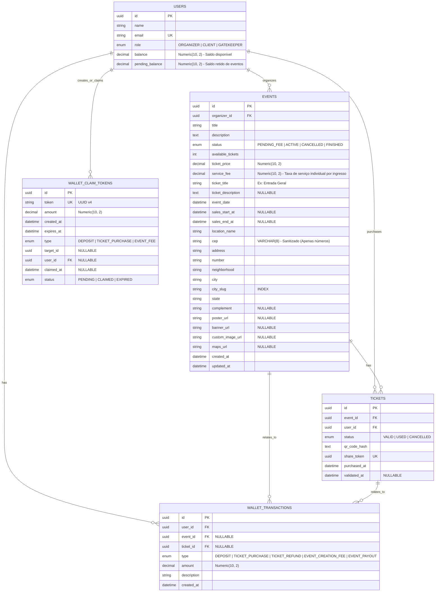

# Arquitetura do Sistema e Modelagem (vzticket)

Visão geral da estrutura de dados, papéis de usuários e relacionamentos entre entidades da plataforma **vzticket**.

---

## Perfis e Autenticação

| Papel | Descrição |
| :--- | :--- |
| **Organizador** | Responsável por criar, configurar e publicar eventos na plataforma. Pago via saldo da carteira ou PIX. |
| **Cliente** | Usuário final que navega no catálogo, adquire ingressos e visualiza sua carteira/QR Codes. |
| **Portaria** | Operador responsável pela validação e leitura dos QR Codes dos ingressos na entrada dos eventos. |

---

## Diagrama Entidade-Relacionamento (ER)

