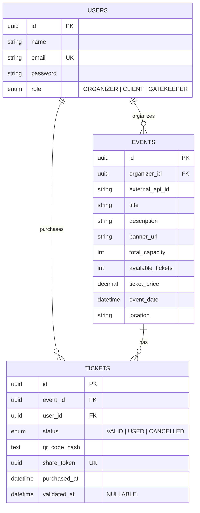

# Especificacoes

## Perfis e Autenticacao

| Papel       | Descricao                                                   |
| ----------- | ----------------------------------------------------------- |
| Organizador | Responsavel por criar e publicar os eventos na plataforma   |
| Cliente     | Usuario final que consome os eventos e adquire ingressos    |
| Portaria    | Operador responsavel pela recepcao e validacao de acesso    |

## Requisitos Funcionais

### Frontend

| ID      | Modulo                 | Descricao                                                            |
| ------- | ---------------------- | -------------------------------------------------------------------- |
| RF-FE01 | Catalogo de Eventos    | Navegacao, busca e filtragem de eventos publicados                   |
| RF-FE02 | Gestao de Eventos      | Interface para organizador criar e configurar eventos                |
| RF-FE03 | Fluxo de Reserva       | Selecao por quantidade de ingressos                                  |
| RF-FE04 | Checkout e Pagamento   | Fluxo de pagamento simulado                                          |
| RF-FE05 | Meus ingressos         | Area autenticada do cliente que exibe o ingresso, detalhes e qrcode  |
| RF-FE06 | Tela de Portaria       | Leitura de QR Code via camera/digitacao manual de token              |
| RF-FE07 | Feedback de Entrada    | Retorno na portaria: valido, invalido, utilizado ou evento errado    |
| RF-FE08 | Assentos em tempo real | Atualizacao da disponibilidade de assentos durante a selecao         |

### Backend
| ID      | Modulo                   | Descricao                                                                                  |
| ------- | ------------------------ | ------------------------------------------------------------------------------------------ |
| RF-BE01 | API Externa              | Integracao com TMDb ou Ticketmaster                                                        |
| RF-BE02 | Autenticacao JWT         | Login/Registro com hash seguro e autenticacao baseada nos 3 papeis                         |
| RF-BE03 | Prevencao de Overbooking | Garantia atomica no banco de dados de que um assento nao sera vendido 2 vezes              |
| RF-BE04 | Seguranca QR Code        | Geracao de QR Code usando payload assinado                                                 |
| RF-BE05 | Compartilhamento         | Endpoint publico para visualizar ingresso atraves de link unico sem login                  |
| RF-BE06 | Validacao Idempotente    | Garantia de que um ingresso transicione para `USED` e nao possa ser revalidado             |
| RF-BE07 | Cancelamento e devolucao | Permitir o cancelamento do ingresso devolvenvo a vaga ao estoque antes do inicio do evento |
| RF-BE08 | Assentos em tempo real   | Atualizacao da disponibilidade de assentos durante a selecao                               |

## Modelagem de dados

